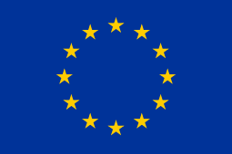

# MeMAD multimodal content analysis: collection of tools and libraries

This repository contains a joint collection of libraries and tools for
multi-modal content analysis from AALTO, EURECOM and INA. The majority
of the tools included have been created before the MeMAD project, but
have been further developed and will continue to be developed during
the project.

The collection consists of the following submodules:

## AALTO
 * PicSOM: <https://github.com/aalto-cbir/PicSOM>
 * DeepCaption: <https://github.com/aalto-cbir/DeepCaption>
 * Statistical tools for caption dataset analysis: <https://github.com/MeMAD-project/statistical-tools>
 * Multi-modal image caption translation: <https://github.com/Waino/OpenNMT-py/tree/develop_mmod>
 * Speech recognition training scripts for Finnish: <https://github.com/psmit/char-fin-2017>
 * Audio event classification: <https://github.com/ZhicunXu/AudioTagger>
 
## EURECOM
 * EUR-FaceRec: <https://github.com/MeMAD-project/EUR-FaceRec.git>

## INA
 * inaSpeechSegmenter: <https://github.com/ina-foss/inaSpeechSegmenter>

  

                         | MeMAD project has received funding from the European Union’s Horizon 2020 research and innovation programme under grant agreement No 780069. This document has been produced by the MeMAD project. The content in this document represents the views of the authors, and the European Commission has no liability in respect of the content.
------------------------------------------------ | --------------------------------------------------------------------------------------------------------------------------------------------------------------------------------------------------------------------------------------------------------------------------------------------------------------------------------------------

